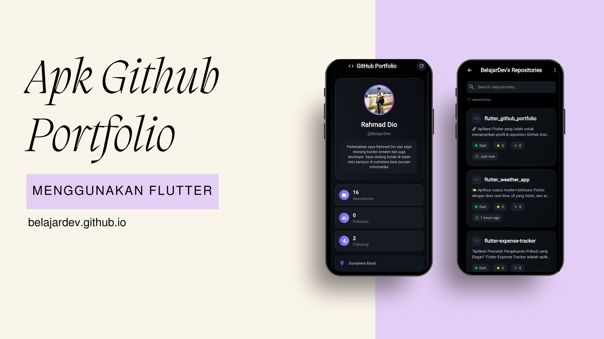

# Aplikasi GitHub Portfolio Flutter

Aplikasi mobile cantik yang dibangun dengan Flutter untuk menampilkan profil dan repository GitHub Anda dengan tema gelap modern.


## ✨ Fitur

- **Tampilan Profil GitHub** - Avatar, bio, statistik, dan informasi
- **Penjelajah Repository** - Lihat semua repository dengan pencarian dan pengurutan
- **UI Gelap Modern** - Background gradient dan efek glassmorphism
- **Data Real-time** - Mengambil data langsung dari GitHub API
- **Desain Responsif** - Berfungsi di ponsel dan tablet

## 📸 Screenshots

<p align="center">
  
</p>

## 🚀 Memulai

### Prasyarat

- Flutter SDK 3.0 atau lebih tinggi
- Android Studio / VS Code
- Akun GitHub

### Instalasi

1. Clone repository

```bash
git clone https://github.com/namauseranda/github-portfolio-flutter.git
```
